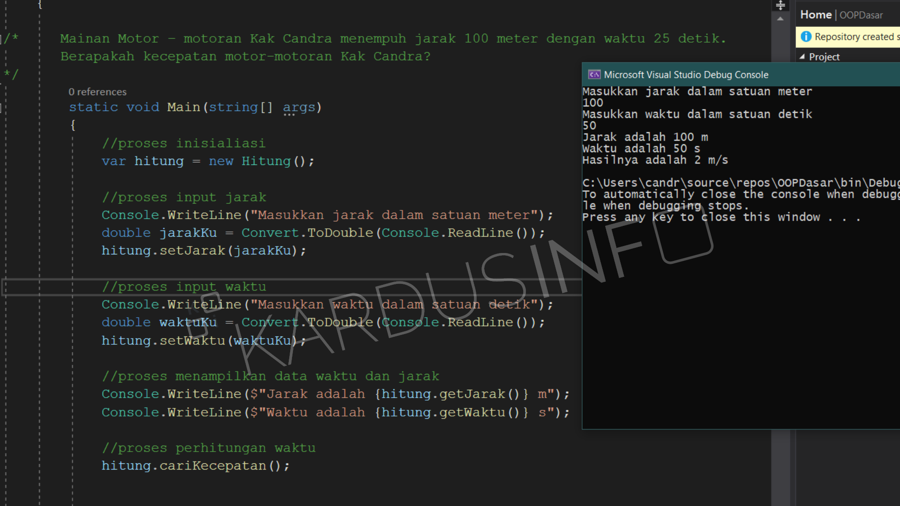

# OOP Rumus Kecepatan
> mencari kecepatan dengan rumus dan konsep oop dalam c#

[](https://github.com/ellerbrock/open-source-badge/)
[](http://badge.fury.io/gh/boennemann%2Fbadges)

One to two paragraph statement about your product and what it does.




[](https://forthebadge.com)

## Usage example


## Development setup

```sh
Open with Visual Studio
```

## Release History


## Meta

Candra Prasetya – [@candra.ramesthy](https://instagram.com/candra.ramesthy) – https://kardusinfo.com

[My Github Account](https://github.com/candraprasetya/)

## Contributing

1. Fork it (<https://github.com/kardusinfo/OOP-Rumus-Kecepatan/fork>)
2. Create your feature branch (`git checkout -b feature/fooBar`)
3. Commit your changes (`git commit -am 'Add some fooBar'`)
4. Push to the branch (`git push origin feature/fooBar`)
5. Create a new Pull Request
